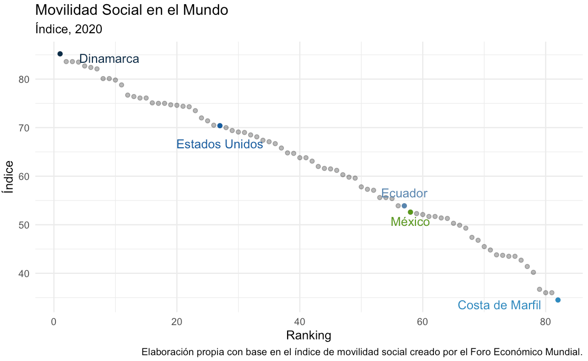

> _Estudia, esfuerzáte, trabaja y ¿triunfarás?_ 

# (In)movilidad social en México

  

> _¡Estudia, esfuerzáte y triunfarás! Los pobres son pobres porque quieren. Al que madruga, Dios le ayuda._ 

Todos hemos escuchado alguna vez comentarios como los anteriores. Incluso, en ocasiones, quizá también fuimos los que vertimos este tipo de comentarios.  ¿Qué tanta veracidad existe en los enunciados anteriores? Si partimos de la premisa de que vivimos en sociedades justas y meritócraticas, los enunciados anteriores podrían ser verídicos: entonces, bastaría ser personas constantes, perseverantes, trabajadoras y estudiosas para ascender a los estratos económicos más altos y privilegiados de la sociedad; y, viceversa, ser personas "flojas", para descender a los percentiles ecónomicos más bajos. Sin embargo, ¿se observa esto en la realidad? Quizá no en México, ¿pero sí en otros países con mayores índices de desarrollo humano? 

Veamos el siguiente gráfico, obtenido con datos dispuestos por el Foro Económico Mundial(FMI) en 2020, en relación a la movilidad social, entendida como el movimiento (hacia arriba o abajo) de las personas, familias y hogares dentro o a través de distintos estratos sociales, en el mundo. En el eje de las *x* tenemos el *ranking* (de mayor a menor) de los países de acuerdo con sus índices de movilidad social. En el eje de las *y*, tenemos el puntaje de movilidad social por país (del 0 al 100); dónde 100 significa movilidad perfecta y cero, la inexistencia de movilidad social. 

  

De acuerdo con esta gráfica, en ningún lugar del mundo existe movilidad social perfecta; es decir, el ideal de que todo individuo puede acceder a un mejor nivel de vida a partir de su propio esfuerzo, sin importar su origen socioeconómico, no se observa. Incluso en países como Dinamarca, el país con mayor movilidad social (*85.2/100*), los resultados de vida de las personas parecen no ser producto exclusivo de sus esfuerzos y méritos individuales. 

Ahora bien, concentrándonos en el caso mexicano, observamos que México ocupa el puesto 58 entre 82 países, en términos de su capacidad de movilidad social. Esto quiere decir que entre los países incluidos en el índice, México es uno de los países con menor movilidad social: los mexicanos que nacen pobres (o ricos), tienden a retener su estatus social de origen, independientemente de su nivel de esfuerzo. ¡Continuemos explorando un poco más a fondo el caso en México!

Gracias a la conjunción de esfuerzos del Instituto Nacional de Estadística y Geografía (INEGI), el Centro de Estudios Espinosa Yglesias (CEEY) y la Fundación Espinosa Rugarcía, I.B.P. (ESRU), en México contamos, desde 2006, con la Encuesta ESRU-EMOVI. A través de esta encuesta, en México existen estudios robustos sobre la movilidad social intergeneracional: correlación existente entre entre la posición económica de una persona con respecto a la de sus progenitores. En particular, el INEGI, a través del Módulo de Movilidad Social Intergeneracional (MMSI), en 2016 presentó información considerando las características sociodemográficas de la población de 25 a 64 años de edad, sus niveles educativos y ocupacionales, a partir de su situación socioeconómica de origen, es decir, cuando tenían 14 años de edad. 

De la revisión de distintas estudios llevados a cabo con la información recabada en estas encuestas, se encuentra en general que México presenta un reto muy grande esta dimensión: al menos 7 de cada 10 mexicanos que nacen en el peldaño más bajo de la escalera socioeconómica del país, no logran superar la condición de pobreza durante su vida (Informe de Movilidad Social,  2019 ). Más preocupante aún, este hallazgo se ha mantenido casi inalterado desde hace 15 años, fecha a partir de la cuál se cuenta con esta Encuesta.

que el centro de estudios ha levantado la encuesta. En la gráfica de abajo, construida con un indice de riqueza apartir de la ESRU-EMOVI 2017, se observa que el 40% de las personas que nacieron en el quintil 1, el estrato más bajo de riqueza, permanece ahí en su vida adulta, y que solo 4% logra llegar al estrato más alto. Por último, otra conclusión en el reporte del CEEY que confirma la debilidad de la movilidad social en México es que los hijos de padres en la clase media tienen más posibilidades de caer hacia los estratos más desfavorecidos que de ascender en la escala de riqueza.

¿Cómo lograr una mayor movilidad social intergeneracional?
A través de la igualdad de oportunidades. 
Implementando políticas públicas basadas, entre otros aspectos, en una educación pública universal y de calidad. 
Fortalecer el empoderamiento de las mujeres en el logro educativo. 

Motivación

¿Por qué es importante?
Resulta crucial para el bienestar de los individuos. 
Una mayor movilidad social conducirá a una prosperidad general y a una sociedad más justa y equitativa. 
Con llevará a un crecimiento económico incluyente y a mayor cohesión social.  
Educación, ¿el motor de la movilidad social en México? - https://ceey.org.mx/educacion-el-motor-de-la-movilidad-social-en-mexico/

Contexto nacional
Realidades de la sociedad mexicana:
7 de cada 10 mexicanos que nacen pobres, permanecerán en la pobreza durante el resto de su vida. 
No se han presentado mejoras sustanciales en el ingreso desde hace al menos 25 años. 
Nivel educativo alcanzado por los hijos de padres sin estudios:
5% profesional 
12% preparatoria
22% secundaria
33% primaria 
17% primaria incompleta
11% sin estudios
(HACER GRAFICA)
La persistencia en el nivel de pobreza de origen es mayor entre las mujeres que entre los hombres

Es indispensable lograr revertir esta situación.

La educación 

Recientemente el autor planteo esta pregunta en su La movilidad social el movimiento o desplazamiento que efectúan los individuos, las familias o los grupos sociales dentro de un determinado sistema socioeconómico

## Movilidad Intergeneracional: Quintiles

<table class="tg" style="undefined;table-layout: fixed; width: 354px">
<colgroup>
<col style="width: 54.45px">
<col style="width: 47.45px">
<col style="width: 49.45px">
<col style="width: 49.45px">
<col style="width: 49.45px">
<col style="width: 49.45px">
<col style="width: 54.45px">
</colgroup>
<thead>
  <tr>
    <th class="tg-fz30" colspan="7">Movilidad Social Intergeneracional Porcentaje</th>
  </tr>
</thead>
<tbody>
  <tr>
    <td class="tg-iks7"></td>
    <td class="tg-mums" colspan="6">Quintil de Destino</td>
  </tr>
  <tr>
    <td class="tg-tfm4" rowspan="6">Quintil de Origen </td>
    <td class="tg-3wlv"></td>
    <td class="tg-3wlv">1</td>
    <td class="tg-3wlv">2</td>
    <td class="tg-3wlv">3</td>
    <td class="tg-3wlv">4</td>
    <td class="tg-3wlv">5</td>
  </tr>
  <tr>
    <td class="tg-11xd">1</td>
    <td class="tg-8x5v">46.97</td>
    <td class="tg-2fdn">25.87</td>
    <td class="tg-2fdn">15.86</td>
    <td class="tg-2fdn">7.97</td>
    <td class="tg-z648">3.34</td>
  </tr>
  <tr>
    <td class="tg-11xd">2</td>
    <td class="tg-2fdn">29.01</td>
    <td class="tg-8x5v">27.98</td>
    <td class="tg-2fdn">20.79</td>
    <td class="tg-2fdn">13.99</td>
    <td class="tg-2fdn">8.23</td>
  </tr>
  <tr>
    <td class="tg-11xd">3</td>
    <td class="tg-2fdn">15.86</td>
    <td class="tg-2fdn">24.2</td>
    <td class="tg-8x5v">26.26</td>
    <td class="tg-2fdn">21.85</td>
    <td class="tg-2fdn">11.83</td>
  </tr>
  <tr>
    <td class="tg-11xd">4</td>
    <td class="tg-2fdn">5.27</td>
    <td class="tg-2fdn">15.34</td>
    <td class="tg-2fdn">24.03</td>
    <td class="tg-8x5v">29.86</td>
    <td class="tg-2fdn">25.5</td>
  </tr>
  <tr>
    <td class="tg-11xd">5</td>
    <td class="tg-qz82">2.29</td>
    <td class="tg-2fdn">6.06</td>
    <td class="tg-2fdn">11.85</td>
    <td class="tg-2fdn">26.14</td>
    <td class="tg-8x5v">53.66</td>
  </tr>
  <tr>
    <td class="tg-3xnc" colspan="7">Fuente: Elaboración propia con base en la Encuesta ESRU-EMOVI, 2017. </td>
  </tr>
</tbody>
</table>

## Movilidad Educacional Intergeneracional

<table class="tg" style="undefined;table-layout: fixed; width: 487px">
<colgroup>
<col style="width: 89.45px">
<col style="width: 57.45px">
<col style="width: 57.45px">
<col style="width: 57.45px">
<col style="width: 57.45px">
<col style="width: 56.45px">
<col style="width: 53.45px">
<col style="width: 57.45px">
</colgroup>
<thead>
  <tr>
    <th class="tg-7fgq" colspan="8">Movilidad Educacional Intergeneracional      Porcentajes</th>
  </tr>
</thead>
<tbody>
  <tr>
    <td class="tg-t0np"></td>
    <td class="tg-kt89" colspan="7"> Educación del Padre   </td>
  </tr>
  <tr>
    <td class="tg-m8mx" rowspan="7"> Educación del  Hijo </td>
    <td class="tg-t0np"> </td>
    <td class="tg-3rd0">1</td>
    <td class="tg-3rd0">2</td>
    <td class="tg-3rd0">3</td>
    <td class="tg-3rd0">4</td>
    <td class="tg-3rd0">5</td>
    <td class="tg-3rd0">6</td>
  </tr>
  <tr>
    <td class="tg-3rd0">1</td>
    <td class="tg-8nap">86.36</td>
    <td class="tg-t0np">7.81</td>
    <td class="tg-t0np">3.89</td>
    <td class="tg-t0np">1.33</td>
    <td class="tg-t0np">0.62</td>
    <td class="tg-w878">0</td>
  </tr>
  <tr>
    <td class="tg-3rd0">2</td>
    <td class="tg-t0np">68.46</td>
    <td class="tg-8nap">23.19</td>
    <td class="tg-t0np">6.82</td>
    <td class="tg-t0np">1.27</td>
    <td class="tg-t0np">0.11</td>
    <td class="tg-t0np">0.15</td>
  </tr>
  <tr>
    <td class="tg-3rd0">3</td>
    <td class="tg-t0np">54.39</td>
    <td class="tg-t0np">21.72</td>
    <td class="tg-8nap">18.81</td>
    <td class="tg-t0np">3.48</td>
    <td class="tg-t0np">0.88</td>
    <td class="tg-t0np">0.73</td>
  </tr>
  <tr>
    <td class="tg-3rd0">4</td>
    <td class="tg-t0np">32.7</td>
    <td class="tg-t0np">22.39</td>
    <td class="tg-t0np">28.4</td>
    <td class="tg-8nap">11.31</td>
    <td class="tg-t0np">3.63</td>
    <td class="tg-t0np">1.58</td>
  </tr>
  <tr>
    <td class="tg-3rd0">5</td>
    <td class="tg-t0np">19.18</td>
    <td class="tg-t0np">15.05</td>
    <td class="tg-t0np">25.67</td>
    <td class="tg-t0np">20.85</td>
    <td class="tg-8nap">12.53</td>
    <td class="tg-t0np">6.72</td>
  </tr>
  <tr>
    <td class="tg-3rd0">6</td>
    <td class="tg-btmi">10.58</td>
    <td class="tg-t0np">11.17</td>
    <td class="tg-t0np">18.8</td>
    <td class="tg-t0np">19.47</td>
    <td class="tg-t0np">16.26</td>
    <td class="tg-8nap">23.74</td>
  </tr>
  <tr>
    <td class="tg-57vz" colspan="8">Fuente: Elaboración propia con datos de la Encuesta&nbsp;&nbsp;&nbsp;ESRU-EMOVI 2017.</td>
  </tr>
</tbody>
</table>

# Descripción breve de modelo

# Resultados

> Descripción perfiles

  

