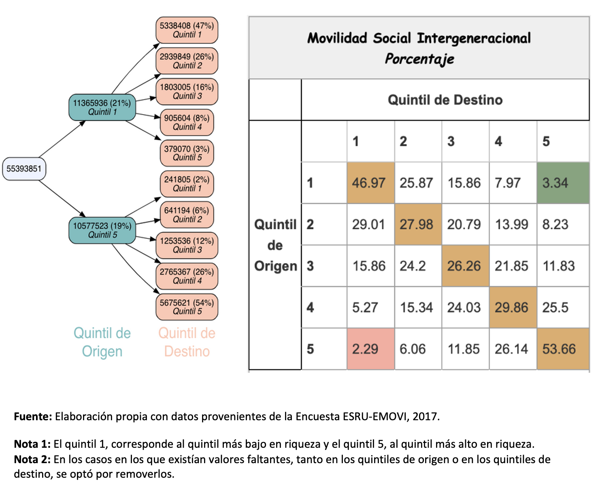

>“Estudia, esfuérzate, trabaja y ¿triunfarás?”

# (In)movilidad social en México

  

  

_¡Estudia, esfuérzate y triunfarás!_

_Los pobres son pobres porque quieren._ 

_Al que madruga, Dios le ayuda._

Todos hemos escuchado o incluso, dicho, comentarios como los anteriores. Pero, ¿qué tan ciertos son esos enunciados? Si existiera una sociedad basada exclusivamente en el mérito, bastaría con ser personas constantes, perseverantes y trabajadoras para ascender a los estratos económicos más altos y privilegiados de la sociedad; mientras que los "flojos" estarían en los estratos económicos más bajos, ¿se observa esto en México? ¿en algún país del mundo?

Este movimiento o desplazamiento (hacia arriba o abajo) de las personas, hogares o grupos sociales a través de distintos estratos socioeconómicos, es conocido como movilidad social y es un elemento muy relevante para el bienestar de los individuos, la cohesión social y el desarrollo de las democracias.  

En ese contexto, el último informe sobre movilidad social elaborado por el Banco Mundial, señala que se ha dado un estancamiento en movilidad social durante los últimos 30 años y que existen diferencias relevantes entre países; en promedio, la movilidad social es menor en las economías en vías de desarrollo que en las economías desarrolladas, lo que se manifiesta en el hecho de que 46 de los 50 países con las tasas más bajas de movilidad educativa ascendente son países en vías de desarrollo.

En el mismo sentido, de acuerdo con el Índice Global de Movilidad Social (IGMS), elaborado por el Foro Económico Mundial, los países con mayor movilidad social son Dinamarca, Noruega, Finlandia y Suecia, mientras que México se ubica en el lugar 58°, de 82 países analizados. En América Latina, la nación con mayor movilidad social es Uruguay, en el lugar 35°, seguido por Costa Rica y Chile, en los puestos 44º y 47º, respectivamente. El ranking completo de países se presenta en el siguiente gráfico (el puntaje de movilidad social por país va de 0 al 100; donde 100 significa movilidad perfecta y cero, la inexistencia de movilidad social).

  

  
De acuerdo con lo anterior, en ningún lugar del mundo existe movilidad social perfecta. Incluso en Dinamarca, el país con mayor movilidad social (85.2/100), las perspectivas de vida de las personas se encuentran relacionadas con la condición social de sus padres y no sólo con sus méritos individuales; en ese país, una persona que nace en una familia pobre le llevaría, en promedio, dos generaciones para alcanzar un ingreso medio; en otros países como Francia se requieren seis generaciones para que ocurra este movimiento y, en casos más extremos (como en Brasil o Sudáfrica), nueve generaciones.

Ahora bien, se observa que México es un país con baja movilidad social: los mexicanos que nacen pobres (o ricos), tienden a mantener su estatus social de origen, lo que representa un fenómeno de estudio muy interesante y relevante para lograr objetivos sobre reducción de pobreza y desigualdad, además de ayudar impulsar el crecimiento económico.

Gracias a la conjunción de esfuerzos del Instituto Nacional de Estadística y Geografía (INEGI), el Centro de Estudios Espinosa Yglesias (CEEY) y la Fundación Espinosa Rugarcía, I.B.P. (ESRU), México cuenta desde 2006, con la Encuesta ESRU-EMOVI y a partir del 2016 con el Módulo de Movilidad Social Intergeneracional (MMSI). Estos datos permiten medir y dar seguimiento a la movilidad social en México a lo largo del tiempo. 

A partir del índice de riqueza elaborado por la ESRU-EMOVI 2017, se observa que el 47 por ciento de las personas que nacen en el primer quintil, el estrato más bajo de riqueza, permanecen en el mismo estrato (fenómeno conocido como sticky floors), y sólo 3.3 por ciento logra posicionarse en el estrato más alto. De forma análoga, alrededor de 54 por ciento de las personas que nacen en el peldaño más alto del estrato social, permanecen en este estrato (fenómeno conocido como sticky ceilings), y solamente 2.3 por ciento, caen hasta el último peldaño. Además, se advierte que los hijos de padres pertenecientes a la clase media (quintiles dos y tres) tienen mayor probabilidad de descender que de ascender en esta escala.

  

  
## La educación, ¿motor para alcanzar mayor movilidad social?

  

¿Cómo podría México lograr avances importantes en materia de movilidad social? En principio, podría pensarse en la educación como un mecanismo para superar el problema de los sticky floors y permitir una mayor movilidad social, pero ¿existe evidencia de que la educación es realmente un factor que ayuda a la movilidad hacia arriba? 

Como primer acercamiento al tema, a partir de los datos de la ESRU-EMOVI 2017, construimos matrices de transición intergeneracionales, que nos permiten observar la distribución de los hijos por quintiles de riqueza, de acuerdo al quintil de su hogar de origen. En particular, se construyó una matriz de transición para cada nivel educativo del entrevistado, en donde se observa que la proporción de los hijos que permanecen en el estrato de origen o se mueven a otros estratos, es diferente para los distintos niveles educativos. 

Por ejemplo, del total de individuos cuyo quintil de origen es el primero (el más pobre dentro de la distribución de riqueza) y que alcanzaron un nivel educativo de primaria, 44 por ciento permanece en dicho quintil; mientras que del total de individuos con origen en el mismo quintil pero que concluyeron estudios profesionales, solamente el 20.7 por ciento permanece en el mismo quintil. Por lo tanto, parecería que entre mayor es el nivel educativo que alcanza el individuo, mayores son sus posibilidades de ascender en los estratos de riqueza.

>p
>p

Por su parte, el Banco Mundial, en su informe Movilidad Económica entre Generaciones, encuentra que las economías con mayor movilidad educativa intergeneracional tienen más probabilidades de alcanzar tasas más altas de crecimiento y reducción de la pobreza. 

En este aspecto, a partir de los datos de la ESRU-EMOVI 2017 se observa que, actualmente, las personas en México cuentan, en promedio, con casi 5 años de escolaridad más que sus padres (13.3 y 7.6 años, respectivamente). Como se muestra en las siguientes tablas, la gran mayoría de las personas que han alcanzado cierto grado educativo, tienen padres con un nivel educativo menor; por ejemplo, 78.5 por ciento de las personas que estudiaron hasta primaria (nivel 3) superó el nivel educativo de la madre (en el 56.4 por ciento de los casos la madre no tenía estudios y en el 22.08 por ciento tenía la primaria incompleta). Asimismo, se advierte que el 86.36 por ciento de los encuestados sin estudios tiene un padre sin estudios y 89 por ciento una madre sin estudios; ninguno de ellos tiene un padre con estudios profesionales. 

>p

  
Con el fin de contar con mayor claridad sobre el papel de la educación en la movilidad intergeneracional en México, se realizó un estudio econométrico con datos de la ESRU-EMOVI, 2017. En primer lugar, se construyó un índice de riqueza para dos generaciones (hogar de origen y hogar del entrevistado), tomando en cuenta diferentes bienes o servicios a los que los hogares tienen acceso. Este índice  permitió clasificar a los hogares en 5 quintiles o categorías (el 1 es el quintil más bajo-con menor riqueza- y el 5 es el más alto-con mayor riqueza). 

A partir de este índice de riqueza, y con información sobre años de educación y otros factores que podrían favorecer o limitar la movilidad ascendente (género, lugar de residencia, color de piel, entre otros), se estimó un modelo de Probit ordenado, para predecir el cambio de la probabilidad de pertenecer a alguno de los quintiles de distribución de la riqueza, cuando cambia algún factor como los señalados. En particular, dado que nos interesa conocer si la educación es un factor que ayuda a la movilidad hacia arriba, analizamos los cambios en probabilidad que se relacionan con cambios en los años de educación de las personas.

## ¿Qué dice la evidencia estadística?

La primera columna de la tabla siguiente presenta la estimación del modelo Probit ordenado en el que la variable dependiente tiene las 5 categorías de riqueza (quintiles) en las que se clasificó a los hogares, y como variables independientes se incluyen las siguientes: educación de la persona, educación del padre, educación de la madre, si la persona es mujer, si el individuo está casado, edad, edad al cuadrado, si la persona vive en una localidad rural, si vive en un lugar inseguro, su color de piel, el quintil de su hogar de origen y la región del país en la que vive. A partir de los resultados que se presentan en esa columna, podemos concluir que  la educación, en términos de años adicionales de educación, es un factor que aumenta la probabilidad de estar en el quintil 5 -más rico- y disminuye la probabilidad de estar en el quintil 1-más pobre. 

  

En la tabla anterior, también aparecen los resultados de la estimación del modelo al calcular los efectos marginales para cada uno de los quintiles de la distribución de la riqueza, para una persona con las características promedio. Puede verse que, manteniendo todo lo demás constante, un año adicional de educación reduce la probabilidad de que esa persona se ubique en el quintil 1, el quintil 2 y el quintil 3, y aumenta la probabilidad de que se encuentre en el quintil 4 y en el quintil 5. Por ejemplo, si la persona promedio estuviera en el quintil uno y decidiera estudiar un año más, su probabilidad de abandonar dicho quintil aumentaría en 1.6 puntos porcentuales (pp); mientras que si se encontrara en el quintil cinco, tendría un aumento de casi 2 pp en la probabilidad de mantenerse en ese quintil. Cabe mencionar que la educación de los padres tiene el mismo efecto en cuanto a que incrementa la probabilidad de que los hijos alcancen mayores estratos de riqueza. 

Las demás variables de control muestran que hay mayor probabilidad de mantenerse en los quintiles bajos si tienes alguna de las siguientes características: eres mujer, eres soltero, eres joven, vives en una localidad rural, enfrentas mayor inseguridad en tu entorno, eres de tez morena o negro, y si vives en alguna de las siguientes regiones: norte-occidente, centro-norte y sur, en lugar de vivir en el centro del país. 

## ¿Estudiar más tiene el mismo efecto para todos?

El modelo que se presenta en este blog puede brindarnos información del efecto de la educación en la probabilidad de que las personas mejoren su calidad de vida, entendido como la posibilidad de acceder a quintiles más altos de la distribución de la riqueza. Sin embargo, el efecto de la educación no es igual para todos, pues depende, entre otras cosas, de las características sociodemográficas de cada persona. Para ejemplificar mejor esta situación, se crearon perfiles o casos hipotéticos de personas, que se desarrollan a continuación. 

+ Caso I: Juana, de Cochoapa el Grande, Guerrero

  

Juana fue entrevistada en la ESRU-EMOVI 2017 y es una mujer de 25 años, soltera y de tez morena, que vive en el municipio de Cochoapa el Grande, una localidad rural, de las más pobres e inseguras del Estado de Guerrero. Juana nació en un hogar en el primer quintil de la distribución de la riqueza; sus padres cuentan con únicamente 3 años de educación y ella, con 6 años de educación. ¿A qué quintil de riqueza es más probable que pertenezca Juana? ¿Qué pasa si Juana aumenta en un año su escolaridad? 

Con el modelo estadístico que construimos es posible responder ambas preguntas. Con el perfil antes descrito, la probabilidad de que Juana pertenezca al primer quintil de la distribución de riqueza es de 97 por ciento. Si mantenemos las características antes descritas, con un aumento en un año de escolaridad, su probabilidad de permanecer en el primer quintil disminuye en 0.79 pp; mientras que su probabilidad de pertenecer al segundo y al tercer quintil aumenta en 0.66 pp y 0.11 pp, respectivamente. 

Ahora, nos preguntamos, ¿cuántos años adicionales de educación requeriría Juana para que su probabilidad de permanecer al primer quintil sea menor a 50 por ciento? Con nuestro modelo estadístico concluimos que Juana tendría que tener 20 años de educación adicionales (26 en total), para que su probabilidad de pertenecer al primer quintil se encuentre por debajo del 50 por ciento (específicamente, en 47.1 por ciento).

+ Caso II: Miguel, de CDMX

  

Un caso opuesto al de Juana, es el de Miguel, un hombre de 40 años, casado y de tez blanca, que vive en una zona muy segura de la Ciudad de México. Miguel nació en un hogar que pertenece al quintil más alto de la distribución de la riqueza; su madre tiene 24 años de educación, su padre 20, y él cuenta también con 20 años de educación. Nuevamente, nos preguntamos, ¿a qué quintil de riqueza es más probable que pertenezca Miguel? ¿Qué pasa si Miguel aumenta en un año su escolaridad?

El modelo nos indica que la probabilidad de que Miguel pertenezca al quintil más alto de la distribución de riqueza es de 92.7 por ciento. Asumiendo que las características de Miguel se mantienen constantes y decide cursar un diplomado con duración de un año, su probabilidad de pertenecer al 5° quintil de la distribución de riqueza aumenta en 1.22 pp y, por lo tanto, disminuye su probabilidad de pertenecer a cualquiera de los demás quintiles. 

Ahora, nos preguntamos, ¿cuántos años menos de educación tendría que haber tenido Miguel para que su probabilidad de permanecer en el 5° quintil fuera menor al 50 por ciento? Con nuestro modelo estadístico concluimos que Miguel tendría que tener 16 años de educación menos (solo 4 años de educación en total), para que su probabilidad de pertenecer al quintil 5° se encuentre por debajo del 50 por ciento (específicamente, en 47.7 por ciento). Aún así, independientemente de su nivel de educación, existe una probabilidad alta de que Miguel permanezca en el quintil más alto de la distribución de riqueza. 

## Índice Estadístico

Ver (aquí)[].

## Contribuciones

Este equipo se conforma por: Rafael Sandoval, Nestor Rodríguez, Marisol Nava, Daniela Pinto, Luis Fierro y Cynthia Valdivia.
El trabajo se dividió, en términos generales, en dos grupos, uno de ellos se ocupó de desarrollar el modelo y otro de incorporar la literatura y motivación. Marisol Nava, Rafael Sandoval y Luis Fierro se encargaron del planteamiento y estimación del modelo; Daniela Pinto, Cynthia Valdivia y Nestor Rodríguez se enfocaron en desarrollar un documento base a partir de la literatura y motivación de la problemática. Como tarea especial, Daniela Pinto se encargó de la creación del blog en Github. Independientemente de esta división, de facto, todos los integrantes del equipo contribuyeron con insumos para el proyecto general y todos estuvieron involucrados en la interpretación de coeficientes y la generación de perfiles. 

## Bibliografía

+ Aguilar, A. A. (2020). Notas de Microeconometría Aplicada.

+ Centro de Estudios Espinosa Yglesias, “Informe Movilidad Social en México 2019. Hacia la igualdad regional de oportunidades”. https://ceey.org.mx/wp-content/uploads/2019/05/Informe-Movilidad-Social-en-México-2019..pdf
 
+ De la Torre, Rodolfo. “Reporte de movilidad social educativa 2020. Una mirada a las diferencias regionales” Centro de Estudios Espinosa Yglesias. https://ceey.org.mx/reporte-movilidad-social-educativa-2020-una-mirada-a-las-diferencias-regionales/

+ Greene, W. H. (2002). Econometric Analysis (5th ed.). Prentice Hall.
 
+ Moreno M., A. Héctor. “Determinantes de la movilidad educativa intergeneracional y políticas públicas para promoverla”. Centro de Estudios Espinosa Yglesias. (2017). https://ceey.org.mx/wp-content/uploads/2018/06/07-Moreno-2017.pdf
 
+ Narayan, Ambar; Van der Weide, Roy. “¿Progreso equitativo? Movilidad económica entre generaciones en todo el mundo. Panorama General”. Grupo Banco Mundial.  https://openknowledge.worldbank.org/bitstream/handle/10986/28428/211210ovSP.pdf?sequence=12&isAllowed=y
 
+ Stock, J. H., & Watson, M. M. (2012). Introducción a la Econometría (3a ed.). Pearson Educación, S.A.

+ Vélez Grajales, Roberto; Monroy-Gómez-Franco, Luis A. “Movilidad social en México: hallazgos y pendientes”. Centro de Estudios Espinosa Yglesias y City University of New York. (2018). https://ceey.org.mx/wp-content/uploads/2018/10/02-Vélez-Grajales-Monroy-Gómez-Franco-2018.pdf
 
+ Vélez Grajales, Roberto; Stabridis, Omar. “Empleados, auto-empleados y empresarios: análisis comparado sobre movilidad social intergeneracional en México”. Centro de Estudios Espinosa Yglesias. (2015). https://ceey.org.mx/wp-content/uploads/2018/06/03-Vélez-Stabridis-2015-1.pdf

+ Vélez Grajales, Roberto; Vélez Grajales, Liliana; Stabridis, Omar. “Construcción de un índice de riqueza intergeneracional a partir de la Encuesta ESRU de Movilidad Social en México (EMOVI)”. Centro de Estudios Espinosa Yglesias. (2015). https://ceey.org.mx/construccion-de-un-indice-de-riqueza-intergeneracional-a-partir-de-la-encuesta-esru-de-movilidad-social-en-mexico/
